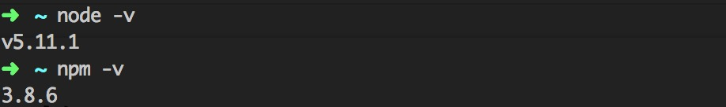

# 快速开始

## 基础环境安装

要使用CMIS提供的开发环境，我们首先需要安装好一些基础依赖。这些依赖虽然和具体的项目无关，但却是运行所有CMIS开发环境所必须的。请按步骤执行。

1. 安装[Node.js](https://nodejs.org/) 和 npm，要求Node.js版本为5.0.0+， npm版本为3.0.0+。安装完成后，可以通过Terminal查看其版本是否符合要求。
  

2. 安装命令行工具。在任意目录下执行```npm i cmis-cli -g``` 安装 **命令行工具**。


## 项目环境安装

在基础环境准备好了之后，需要在我们的项目中安装具体的开发环境来支持我们的日常开发。具体过程如下

1. 选定一个目录作为项目的根目录，进入该目录。
2. 执行```npm i cmis-env-spa``` 安装 **cmis单页应用开发环境```。
> 该过程所需的时间视当时的网络环境而定，请耐心等待，如果长时间未完成，请强制终止安装过程，重试一次。
3. 执行```cmis -v```查看当前安装的环境版本，如果该命令成功执行，则表明安装过程顺利完成。

## 初始化项目
