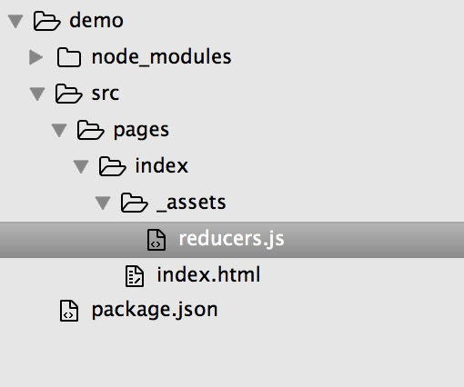

# 让页面“活”起来

在[快速开始](#快速开始.md)的示例中，我们创建了第一个页面。在该页面中所包含的内容是一段“硬编码”的文案，在显示的场景中，除了这些固定的文案之外，我们的页面通常还需要显示一些动态的内容，下面的内容将介绍如何在CMIS提供的开发环境中为页面插入动态内容。

## 场景：切换欢迎辞

在前一个例子中，我们在页面中显示了“Hello World!”，在本例中，我们将在这个页面的基础上增加一个按钮，用以切换显示的欢迎文案。

## 应用状态与UI状态

在CMIS中，所有**可变的内容都应该是被管理起来的**。你可以称这些可变的内容为```数据```，也可以称其为```状态```。在之后的文档中，我们将会统一地称这些被管理起来的内容为```状态```。

为了更好地管理应用的```状态```，CMIS对它们进行了一个简单的切分：**所有和UI相关的状态都被划分称```UI状态```，而所有和应用所承载的业务相关的状态被划分成```应用状态```**。

> 提示：在开发中，有时候会遇到不能很明确地区分某个```状态```的类别时，有一个简单的规则可以指导进行划分：**所有来自服务器端的或者将要提交到服务器端的内容首选划分成```应用状态```**。
> 
> 警告：这种划分原则并不一定是百分百可行的。

## 描述状态

为了能改变欢迎辞，我们需要在页面中为它定义一个对应的```状态```。

在CMIS中，我们可以在```页面目录```下的```_assets/reducers.js```文件中来描述当前页面所用到的```状态```。

在创建了```_assets/reducers.js```文件之后，我们的目录结构大致上如下图所示：



打开```_assets/reducers.js```文件，输入以下内容：

```javascript
'use strict';

// 导出ui状态的定义函数
export const ui = (state = {
    // UI状态的初始化值
    welcomeText: 'Good morning，李雷'
}, action) => {
    // 不做任何处理，直接返回状态
    return state;
};
```

在该文件中，我们把欢迎辞划分为```UI状态```。要成功定义```应用状态```和```UI状态```，CMIS要求```reducers.js```文件为这两种类型的状态分别导出两个```function```，对应于```应用状态```的 ```function``` 被命名为 ```app```，对应于```UI状态```的 ```function``` 被命名为 ```ui```。

每一个 ```function``` 接受两个参数，第一个参数```state```代表当前页面的```状态```，第二个参数 ```action``` 代表一个 ```动作```，该 ```fucntion``` 的函数体可以根据 ```action``` 携带的一些信息对当前的```state```做出一些修改。不论我们在 ```function``` 中做了什么事情，最终，我们**必须返回一个对象**，该对象代表了某一时刻下页面的某一类```状态```。

> 提示：对于上一段中提到的 ```某一类状态```，其具体代表的是```APP状态```还是```UI状态```，是根据导出的 ```function``` 是属于 ```app``` 还是 ```ui``` 来决定的。
>
> 补充：关于 ```动作``` 的介绍将在后续进行说明。

在完成了```reduces.js```文件的编写后，我们已经成功为当前页面定义了```UI状态```，该类别的状态中只有一个具体的项：```welcomeText```， 其初始值为：“Good morning，李雷”。由于在该```funciton```的函数体中我们没有做任何事，所以，**我们没有定义任何改变```UI状态```的行为**。

## 使用状态

```状态``` 定义完毕之后，我们需要做的就是修改```页面主文件```，在适当的位置使用这些```状态```，以发挥它们的作用。

为了能够在```页面主文件```中访问到我们定义的```状态```，CMIS为```页面主文件```提供了两个“全局变量”：```$appState``` 和 ```$uiState```，其分别代表了当前页面的```APP状态``` 和 ```UI状态```。

> 在后续的文档中，将会用 ```$appState``` 来代替 ```APP状态```，用 ```$uiState``` 来代替```UI状态``` 进行描述。

打开```页面主文件```，输入以下内容：

```html
<h1>{$uiState.welcomeText}</h1>
```

> ```页面主文件``` 中的内容在形式上看起来就像一个 ```HTML``` 文件。但是我们可以通过使用大括号 ```{}``` 来插入一些动态的内容，这些动态内容必须是合法的 ```javascript``` 代码。
>
> 实际上，```页面主文件``` 的内容是[jsx](https://facebook.github.io/react/docs/jsx-in-depth.html)语法的超级。