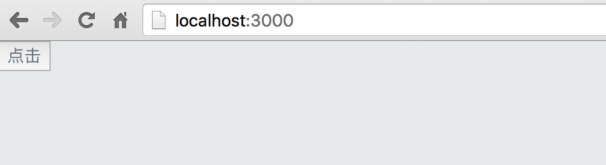
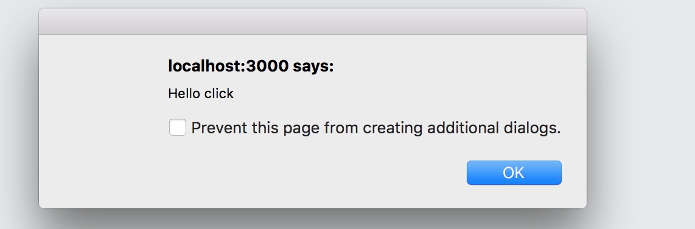

# 响应用户操作

在本节中我们将了解到如何在CMIS支撑的项目中为 ```HTML元素``` 添加事件监听器，用以响应用户的操作。

## 添加事件监听器

要为某个 ```HTML元素``` 添加事件监听器，我们需要在 ```页面主文件``` 中找到相应的 ```HTML标签```， 通过使用 ```DOM Level 0 Event``` 的方式在元素的标签上添加事件监听器。

举例来说，我们要为一个按钮添加点击事件时，可以这样做：

```html
<!-- 点击事件绑定示例 -->
<%@route path="/"%>

<button onclick={ _EventHandler_ }>点击</button>
```

> 在上面的示例代码中，我们通过为 ```button``` 添加名为 ```onclick``` 的 ```attribute``` 来申明需要关心该按钮的 ```点击事件```。```onclick attribute``` 的值就是这一事件发生时我们要采取的 ```操作```，这个 ```操作``` 通常就是我们所说的 ```事件处理器```。

```onclick attribute``` 的值是一个被一对大括号 ```{}``` 括起来的内容，在 [显示动态内容](#显示动态内容) 这一节中我们了解到这是一种插入动态内容的方式。而其中的内容 ```_EventHandler``` 是一个占位符，其代表的是我们需要提供的 ```事件处理器```， 它的类型应该是一个 ```function``` 。

## 定义事件处理器

在上面的示例代码中，我们为了监听 ```button``` 的 ```点击事件``` 而临时添加了一个名为 ```_EventHandler_``` 的事件处理器的**占位符**。在实际的使用中，这个占位符必须被替换成一个 ```有效的function``` 才能成功监听事件。

那我们的事件处理器来自于何处呢？

CMIS允许用户在 ```页面目录``` 下定义一个 ```_assets/controller.js``` 文件，用户可以利用该文件**导出**一系列的 ```function```，在 ```页面模板``` 中，我们可以通过“全局变量” ```$controller``` 访问这些**导出的 ```function```**。

这些导出的 ```function``` 被视为 ```控制器函数```。你可以利用这些 ```控制器函数``` 来 **控制页面中各个部分间的通信以及整个页面内部的业务流程**。每一个 ```控制器函数``` 都会接受一个当前 ```页面上下文对象``` 作为其第一个参数，其他的参数则是 ```控制器函数``` 的使用者在 **触发该控制器时所传递的参数**。

> 在某种程度上，你可以认为```控制器函数``` 是 ```JS代码``` 和 ```页面模板``` 中的 ```HTML元素``` 间通信的一个 ```桥梁```。

> 关于 ```控制器函数``` 的第一个参数 ```页面上下文对象``` 的细节会在后续文档中介绍，在这里仅需要知道其存在即可。

新建文件 ```_assets/controler.js```，在其中输入如下内容:

```javascript
// 导出button的click事件处理器
export function sayHello($context, evt) {
alert('Hello' + evt.type);
}
```

然后修改 ```页面模板``` 中代码为:

```html
<%@route path="/"%>

<button onclick={ $controller.sayHello }>点击</button>
```

执行构建：```cmis build```，然后在浏览器中访问：```http://localhost:3000/```，将看到如下效果：



点击页面中的按钮，将会弹出一个对话框：


